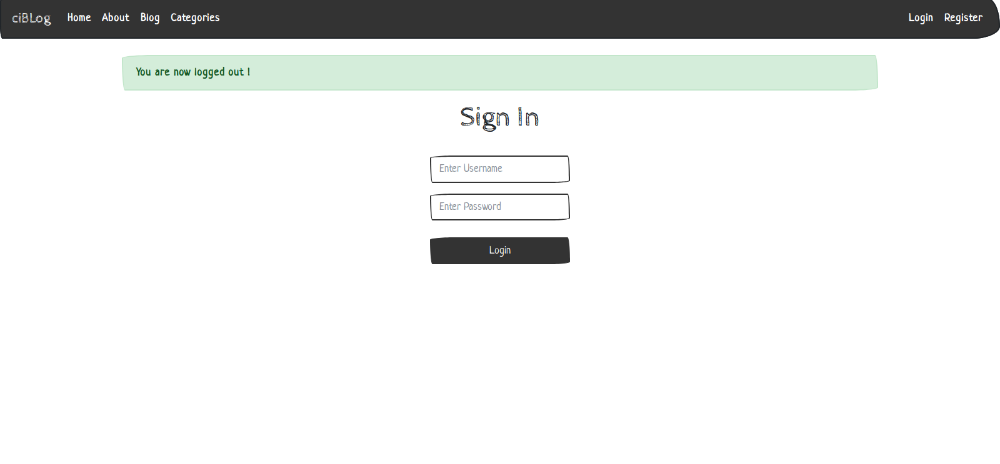
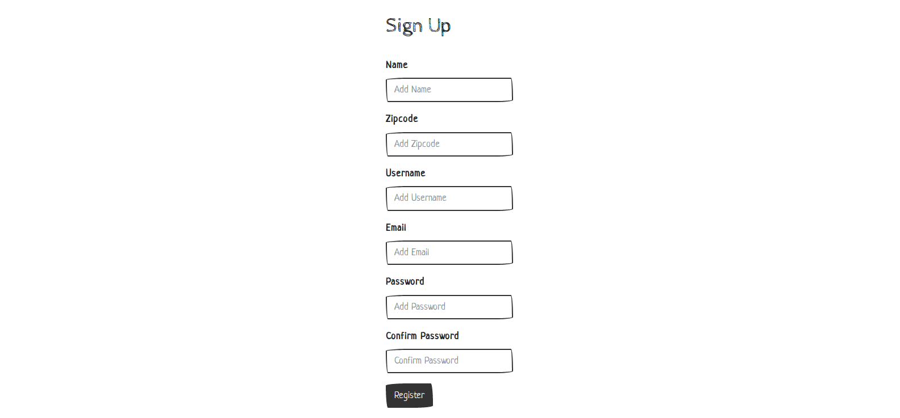
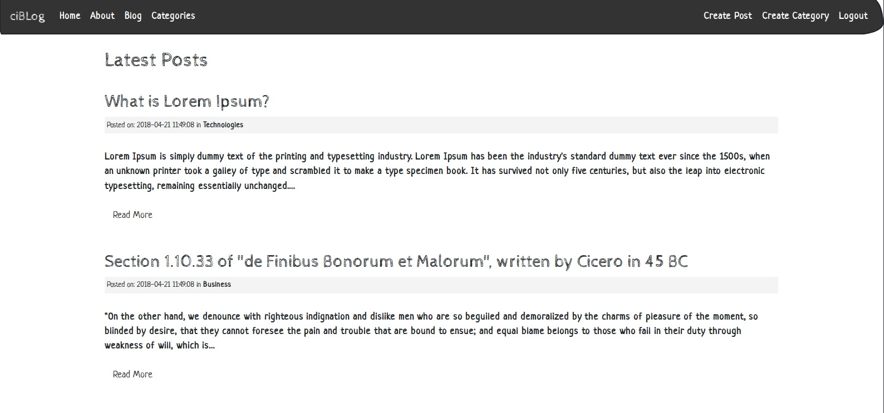
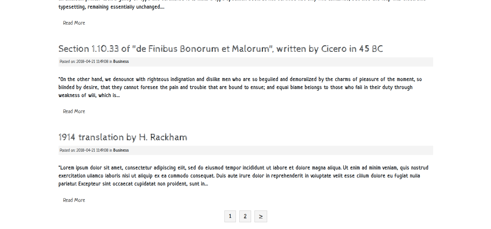
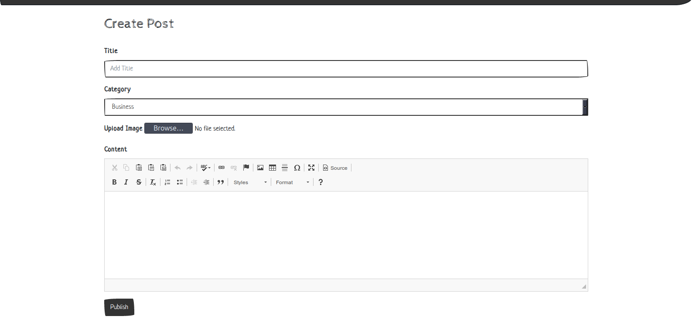
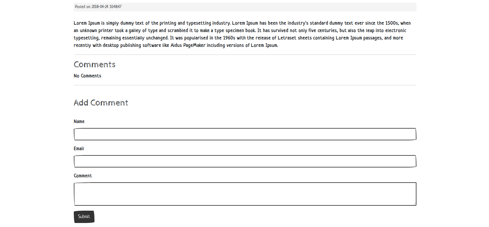
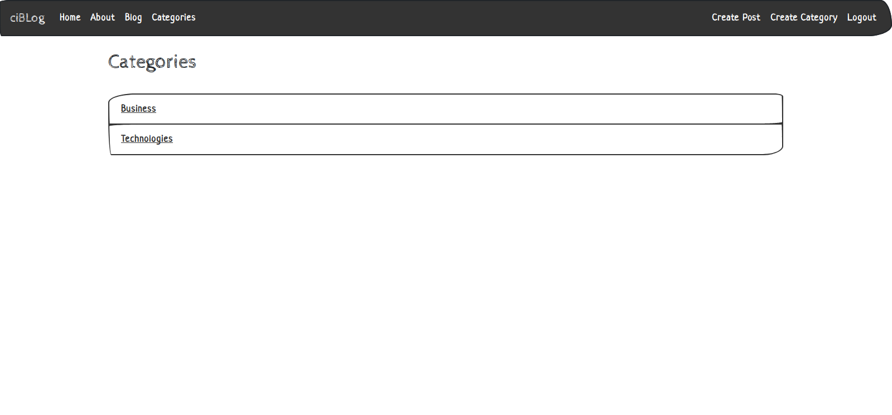
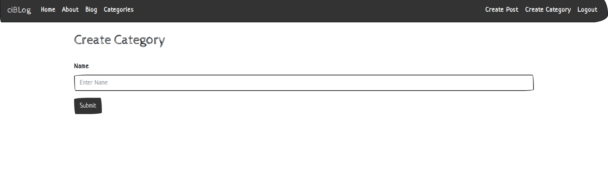

<h1>Blog App /CRUD/ built with Codeigniter framework</h1>

  
   
  
   
  
   
  
   
  
   
  
   
  
   
  

<h1>SQL</h1>

CREATE TABLE `posts` (
  `id` int(11) NOT NULL AUTO_INCREMENT,
  `category_id` int(11) NOT NULL,
  `user_id` int(11) NOT NULL,
  `title` varchar(255) NOT NULL,
  `slug` varchar(255) NOT NULL,
  `body` text NOT NULL,
  `post_image` varchar(255) NOT NULL,
  `created_at` timestamp NOT NULL DEFAULT CURRENT_TIMESTAMP,
  PRIMARY KEY (`id`)
) ENGINE=InnoDB;

CREATE TABLE `categories` (
  `id` int(11) NOT NULL AUTO_INCREMENT,
  `user_id` int(11) NOT NULL,
  `name` varchar(255) NOT NULL,
  `created_at` timestamp NOT NULL DEFAULT CURRENT_TIMESTAMP,
  PRIMARY KEY (`id`)
) ENGINE=InnoDB;

CREATE TABLE `comments` (
  `id` int(11) NOT NULL,
  `post_id` int(11) NOT NULL,
  `name` varchar(255) NOT NULL,
  `email` varchar(255) NOT NULL,
  `body` text NOT NULL,
  `created_at` timestamp NOT NULL DEFAULT CURRENT_TIMESTAMP,
  PRIMARY KEY (`id`)
) ENGINE=InnoDB;

CREATE TABLE `users` (
  `id` int(11) NOT NULL,
  `name` varchar(255) NOT NULL,
  `zipcode` varchar(255) NOT NULL,
  `email` varchar(255) NOT NULL,
  `username` varchar(255) NOT NULL,
  `password` varchar(255) NOT NULL,
  `register_date` timestamp NOT NULL DEFAULT CURRENT_TIMESTAMP,
  PRIMARY KEY (`id`)
) ENGINE=InnoDB;
